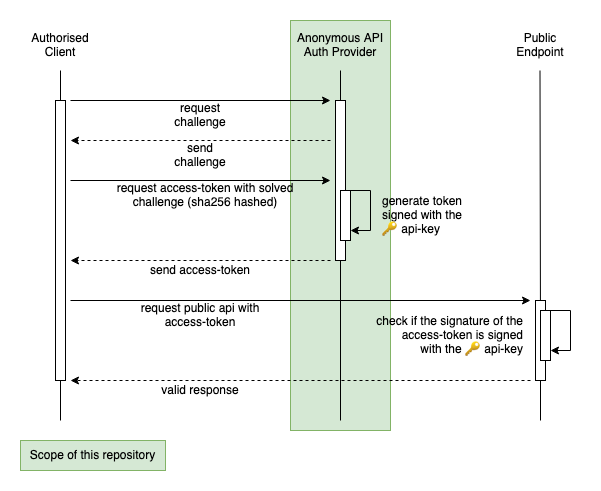

# Public API Auth Provider

Inspired by: https://hackernoon.com/improve-the-security-of-api-keys-v5kp3wdu

## Architecture

The basic idea is, to prevent unauthorised access of public apis by for example bots or bad clients. For example when you have a `POST` interface which should only be requested by your own website. All other requests to this public `POST` endpoint should be rejected.

This Repository introduces a separate serive, the "Public API Auth Provider" (`paap`), which can be requested to retrieve a session token, which can be used to request the public `POST` api.

The `paap` and the public api therefore share an api-key as secret. The `paap` signs the token with the api-key and the public api can check if the signature was signed with the api-key. Otherwise the public api would reject the request.

But before the `paap` generates the session token and sends it to the requesting client, the client has to solve a challenge. This challenge is the shared secret between the `paap` and the authorised client (e.g. your website):



A bad client or a bot cannot solve the challenge provided by the `paap`. In this case the `paap` would send the client a invalid session token, and the public api check for the token signature would fail. The request would be rejected:


An attacker of this public api would have to reverse engineer the authorised client, to find out how the challenge of the `paap` could be solved. This comes with an reasonable amount of effort especially when the code is obfuscated.

## Usage

Define your own `challenge.sh` & `response.sh` and mount them into the docker image.

- Make sure to provide a randomly unique challenge on every execution of the `challenge.sh`.
- Make sure to implement the `response.sh` to generate a deterministic response on each given input generated by the `challenge.sh`  
  :warning: The response must also be implemented on your client.
- Define an api-key and provide it in the environement variables of the docker image.
- Define how long the token should be valid  
  :warning: The token lifetime should be validated in your public api, as well as the token signature.

## Docker

```bash
# build
docker build -f docker/Dockerfile -t authprovider .
# run
docker run -p 8080:8080 -v `pwd`/path/to/your/own/scripts/folder:/service/scripts -e API_KEY=your-api-key -e TOKEN_EXPIRE=3600 authprovider
```

## Known Limitations

- clustering currently not possible  
  will be possible in the future with redis integration
